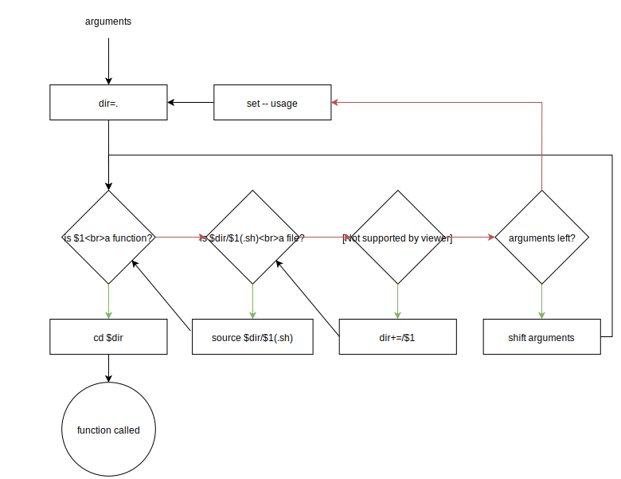

# Gabr.sh
[](https://www.npmjs.com/package/gabr)
[](https://travis-ci.org/nicobrinkkemper/gabr.sh)
## Installation
### Try out as portable file
```shell
$ wget https://raw.githubusercontent.com/nicobrinkkemper/gabr.sh/master/gabr.sh
$ source ./gabr.sh
```

### Install with git
```shell
$ git clone https://github.com/nicobrinkkemper/gabr.sh.git gabr
$ cd gabr
$ npm link
```
> When installed with `npm link`, `gabr` will run as a file.
> If you want to run `gabr` as a local function, try `source $(which gabr)`

### Install with npm
```shell
$ npm install --save-dev gabr
$ npm link gabr
```

## What is gabr.sh
Gabr is a Bash function designed to call other Bash functions.
Gabr takes arguments and will try to turn that in to a function call.
Gabr takes the path of least resistance towards a function call.
Let's illustrate that with a flowchart.




> This flow-chart doesn't show how errors are handled.
> When a argument is neither a function, file or directory a warning will show and the process is stopped.
> For this reason it is rare to get to the `set -- usage` part, unless `gabr` is called
> without any arguments.

Let's illustrate further with a code example. 
```shell
$ echo "\
printf hello
function helloworld() {
  printf ' world\n'
}
" > ./helloworld.sh
$ gabr helloworld
hello world
```
> By naming the file and the function helloworld,
> a tiny API emerged to call the function.

## Why use gabr.sh?
Consider the following commands to delete a tag with git:
```shell
git tag -d 1.0.1
git push origin :refs/tags/1.0.1
```
I'll be honest to myself and say I won't remember this next time.
Besides I have a lot of tags to delete.
I can just write a quick function.
```bash
set -eu
function deleteTag() {
    git tag -d $1
    git push origin :refs/tags/$1
}
```
To run this like `gabr` would, one could simply write:
```shell
$ (. git.sh; deleteTag 1.0.1)
```
But doing it like this is hard to communicate and prone to human error. With `gabr` a more direct API emerges to do these kind of things:
```
$ gabr git deleteTag 1.0.1
```

## Variables
### Local variables
Gabr defines the following local variables. These will be available in files sourced by Gabr. Variables that already exist will be inherited.

| variable     	| type  	| description                              	| default                                	| Note                                    	|
|--------------	|-------	|------------------------------------------	|----------------------------------------	|-----------------------------------------	|
| root         	|       	| The fallback directory                   	| $PWD                                   	| May be set by `GABR_ROOT`    	            |
| default      	|       	| Name of fallback function                	| usage                                  	| May be set by `GABR_DEFAULT`            	|
| $default     	|       	| String printed by fallback function      	| $usage                                   	| See [Functions](#Functions)              	|
| usage        	| -A    	| Usage string                            	| "Usage: gabr [file] function..."         	|                                          	|
| fn           	|       	| The called function                      	|                                     	|                                         	|
| args         	| -a    	| The arguments for the function           	| ()                                     	| Also available as ${@}                    |
| file        	|       	| The sourced file                       	|                                         	|                                         	|
| dir          	|       	| The relative directory of the file     	| .                                      	| Wil be cd'd to before calling the function|
| ext          	|       	| The extension to use       	            | .sh                                      	| Gabr also looks for files without extension|
| fullCommand  	|       	| The full initial command as string        | gabr ${@}                               	| Handy for custom `usage` implementations. See `./example/usage.md` |

### Global variables
### GABR_STRICT_MODE (default:on)
A global variable called `GABR_STRICT_MODE` may be used to toggle the following snippet:
```bash
set -eEuo pipefail
local IFS=$'\n\t'
trap 'return $?' ERR SIGINT
```
This snippet will run once inside the subshell where the function is called and the file is sourced.
Let's go over the three lines:

1)
    `set` allows you to change the values of shell options and set the positional parameters, or to display the names and values of shell variables. ([reference](https://www.gnu.org/software/bash/manual/html_node/The-Set-Builtin.html))
    - **-x** Enter debug mode
    - **-e** Exit immediately on errors
    - **-E** Inherit traps
    - **-u** Error on unset variables
    - **-o pipefail** the return value is that of the last error
    
2)  `IFS` is a string treated as a list of characters that is used for field splitting.
    By default, this is set to \<space> \<tab> \<newline>. \<space> causes issues when entering 
    arguments that contain spaces, such as sentences. This is why `IFS` is set to
    \<tab> \<newline> in strict-mode. ([reference](https://pubs.opengroup.org/onlinepubs/9699919799.2018edition/utilities/V3_chap02.html#tag_18_05_03))
    
3)
    If `return` is executed by a `trap ERR` handler, the last command used to determine the non-zero status is the last command executed before the trap handler. They will ensure the conditions obeyed by the errexit (-e) option. This is mainly to support older Bash versions. Furthermore, `SIGINT` will be handled the same way, which allows a user to interrupt (ctrl+C) any long running script. ([reference](https://www.gnu.org/software/bash/manual/html_node/Bourne-Shell-Builtins.html))

To opt-out of strict-mode:
```shell
$ export GABR_STRICT_MODE=off
```

### GABR_DEBUG
Setting this variable to a value will turn on debug mode for files and functions.
The `gabr` function will do `set -x` before and `set +x` after every
file source and function call.
```shell
$ export GABR_DEBUG=true
```

### GABR_ROOT / root
A global variable called `GABR_ROOT` may be used to influence the value of `root`. 
`root` is used as a fall-back directory. The fall-back directory will be consulted
when no other options are available.

```shell
$ export GABR_ROOT=$(git rev-parse --show-toplevel)
```
> This will make files at the root of a git repository available from anywhere

### GABR_DEFAULT / default
A global variable called `GABR_DEFAULT` may be used to influence the value of `default`. 
`default` may be used to change the namespace of the fall-back function.
```shell
$ export GABR_DEFAULT=help
```
> This will change `usage` to `help`. Also see [functions](#Functions)

## Functions

### function usage ()
What's a good loop without a good exit case? If no arguments were given to `gabr`, there must still be something
it can do. Exactly, it will look for a function called usage. It will do this like it would do for any other function.
First the function check, then file, then directory. If even that fails, a last-resort function
will be generated:
```bash
local usage="gabr [directory | file] function [arguments] -- A function to call other functions."
function usage() {
    echo $usage >&2
}
```
> A example of extending usage behavior is given in [example/usage.sh](./example/usage.sh)
> but could be improved upon.

If a file is sourced that doesn't contain a function with the same name.
The following snippet could benefit end-users.

```bash
if [ $# -eq 0 ]; then
    usage='help-info-for-this-file'
    set -- usage
fi
```
Or as a function

```bash
if [ $# -eq 0 ]; then
    set -- usage
fi
function usage(){
    echo 'help-info-for-this-file'
}
```

### function $default ()
The namespace for `usage` may be altered with `GABR_DEFAULT` or simply `default`.
If `default` is not set to `usage`, `gabr` generates a last-resort function and variable for this name instead.
This is done through variable indirection. ([reference](https://www.gnu.org/software/bash/manual/html_node/Shell-Parameter-Expansion.html))

In most cases, the following snippet would suffice for files that don't contain a function
with the same name:
```bash
if [ $# -eq 0 ]; then
    set -- otherUsage
fi
otherUsage(){
    "help-info-for-this-file"
}
```
But you can take it further
```bash
if [ $# -eq 0 ]; then
    default=otherUsage
    otherUsage="help-info-for-this-file"
    set -- $default
fi
```
And even further with globals.
```shell
$ export GABR_DEFAULT=index
$ mkdir -p example_default
$ echo "\
index(){
    find *.sh
}
" > ./example/index.sh
```


```bash
if [ $# -eq 0 ]; then
    default=otherUsage
    otherUsage="help-info-for-this-file"
    set -- $default
fi
```


## Flags

Gabr does not require any flags. Gabr stops on any argument that starts with a dash (-).
